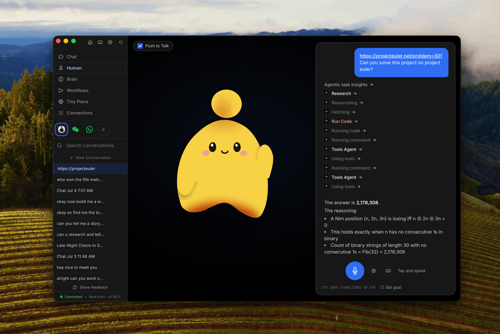

<p align="center">
  🇺🇸 <a href="../README.md">English</a> | 🇨🇳 <a href="./README.zh-CN.md">简体中文</a> | 🇯🇵 <a href="./README.ja-JP.md">日本語</a> | 🇰🇷 <a href="./README.ko.md">한국어</a> | 🇩🇪 <a href="./README.de.md">Deutsch</a> | 🇵🇰 <a href="./README.ur-pk.md">اردو</a>
</p>

<h1 align="center">OpenHuman</h1>

<p align="center">
 
</p>

<p align="center" style="display: inline-block">
 <a href="https://trendshift.io/repositories/23680" target="_blank" style="display: inline-block">
  
 </a> 
 &nbsp;
 <a href="https://www.producthunt.com/products/openhuman?embed=true&amp;utm_source=badge-top-post-badge&amp;utm_medium=badge&amp;utm_campaign=badge-openhuman" target="_blank" rel="noopener noreferrer">
  
 </a>
 
</p>

<p align="center">
 <strong>OpenHuman 是你的个人 AI 超级智能：本地记忆，按需托管服务，简洁而强大。</strong>
</p>


<p align="center">
 <a href="https://discord.tinyhumans.ai/">Discord</a> •
 <a href="https://github.com/tinyhumansai/openhuman/discussions">Discussions</a> •
 <a href="https://x.com/intent/follow?screen_name=tinyhumansai">X/Twitter</a> •
 <a href="https://tinyhumans.gitbook.io/openhuman/">文档</a> •
 <a href="https://x.com/intent/follow?screen_name=senamakel">关注 @senamakel（作者）</a>
</p>

<p align="center">
 
 <a href="https://github.com/tinyhumansai/openhuman/releases/latest"></a>
 <a href="https://github.com/tinyhumansai/openhuman/stargazers"></a>
 <a href="../LICENSE"></a>
 <a href="../README.md"></a>
 <a href="./README.ja-JP.md"></a>
 <a href="./README.ko.md"></a>
 <a href="./README.de.md"></a>
 <a href="./README.ur-pk.md"></a>
</p>

> **早期测试版**：正在积极开发中，可能存在不完善之处。

> **本地 + 托管服务，upfront：** OpenHuman 将记忆树、Obsidian 风格 Markdown 仓库、工作区配置和本地运行时状态存储在你的机器上。默认的托管体验仍然使用 OpenHuman 托管服务进行账户登录、模型路由、网页搜索代理，以及通过 Composio 连接器层的托管集成/OAuth 流程。如果你想自带模型、搜索或 Composio 凭据，请选择自定义/本地设置；某些实时触发器和托管功能仍然需要托管后端。

要安装或开始使用，请从 [tinyhumans.ai/openhuman](https://tinyhumans.ai/openhuman?utm_source=github&utm_medium=readme) 下载，或在终端中运行：

```bash
# 从 https://tinyhumans.ai/openhuman 下载 DMG、EXE，或在终端中运行

# macOS 或 Linux x64
curl -fsSL https://raw.githubusercontent.com/tinyhumansai/openhuman/main/scripts/install.sh | bash

# Windows
irm https://raw.githubusercontent.com/tinyhumansai/openhuman/main/scripts/install.ps1 | iex
```

<!-- TODO: translate (zh-CN) — English source mirrored from README.md so non-EN readers get the same install caveats. Please translate. -->
> **Linux:** the AppImage can crash on launch under Wayland (and on Arch-based distros with `sharun: Interpreter not found!`) — see [#2463](https://github.com/tinyhumansai/openhuman/issues/2463) for the cause and env-var workarounds.
Arch Linux package maintainers can use the [`openhuman-bin` AUR recipe](../packages/arch/openhuman-bin/);
once published, Arch users can install it with `yay -S openhuman-bin`.
<!-- /TODO -->

# 什么是 OpenHuman？

OpenHuman 是一个开源智能助手，旨在融入你的日常生活。以下每条链接都指向[文档](https://tinyhumans.gitbook.io/openhuman/)中更详细的说明。

- **简洁、UI 优先、人性化** — 清爽的桌面体验和简短的入门流程让你从安装到拥有一个可用的智能体仅需几次点击——无需先配置，无需终端。智能体有[一张脸](https://tinyhumans.gitbook.io/openhuman/features/mascot)：一个桌面吉祥物，会说话、能感知周围环境、可作为真实参与者[加入你的 Google Meet 会议](https://tinyhumans.gitbook.io/openhuman/features/mascot/meeting-agents)、跨周记住你，即使你停止输入后仍在后台持续思考。

- **[118+ 第三方集成](https://tinyhumans.gitbook.io/openhuman/features/integrations) + [自动拉取](https://tinyhumans.gitbook.io/openhuman/features/obsidian-wiki/auto-fetch)**：通过**一键 OAuth** 接入 Gmail、Notion、GitHub、Slack、Stripe、Calendar、Drive、Linear、Jira 以及你技术栈中的其他服务。每个连接都以类型化工具的形式暴露给智能体，核心每 20 分钟遍历每个活跃连接并将新数据拉入[记忆树](https://tinyhumans.gitbook.io/openhuman/features/integrations/auto-fetch)中。无需提示词，无需手动编写轮询循环，智能体在每天早上就已经拥有当天的上下文。

  托管集成使用 OpenHuman 的 Composio 连接器层。OAuth 握手和集成工具调用默认通过托管后端代理。如果你想直接运行 Composio，请使用你自己的 Composio API key 配置直连模式；实时触发器 webhook 则需要由你自行托管和接入。

- **[记忆树](https://tinyhumans.gitbook.io/openhuman/features/memory-tree) + [Obsidian Wiki](https://tinyhumans.gitbook.io/openhuman/features/obsidian-wiki)**：一个基于你的数据和活动构建的本地优先知识库。你连接的所有内容都被规范化为不超过 3k token 的 Markdown 片段，经过评分后折叠成层级化的摘要树，存储在**你本机的 SQLite** 中。同样的片段以 `.md` 文件形式落地到兼容 Obsidian 的仓库中，你可以打开、浏览和编辑，灵感来源于 Karpathy 的 [obsidian-wiki 工作流](https://x.com/karpathy/status/2039805659525644595)。

- **开箱即用**：默认内置网络搜索、网页抓取[爬虫](https://tinyhumans.gitbook.io/openhuman/features/native-tools)、完整的编码工具集（文件系统、git、lint、test、grep）以及[原生语音](https://tinyhumans.gitbook.io/openhuman/features/native-tools/voice)（STT 输入、ElevenLabs TTS 输出、吉祥物口型同步、实时 Google Meet 智能体）。默认情况下，[模型路由](https://tinyhumans.gitbook.io/openhuman/features/model-routing)使用 OpenHuman 后端来选择和代理每个工作负载的合适 LLM（推理型、快速型或视觉型）。一个订阅包含所有模型。没有"安装插件才能读文件"的摩擦。[可选通过 Ollama 使用本地 AI](https://tinyhumans.gitbook.io/openhuman/features/model-routing/local-ai) 处理端侧工作负载。

- **[智能 Token 压缩（TokenJuice）](https://tinyhumans.gitbook.io/openhuman/features/token-compression)**：每个工具调用、抓取结果、邮件正文和搜索载荷在触达任何 LLM 模型之前都会经过 token 压缩层处理。HTML 被转换为 Markdown，长 URL 被缩短，冗长的工具输出会通过可配置的规则层去重并摘要等等。中文、emoji 等多字节字符按字形（grapheme）完整保留，绝不丢弃。你获得相同的信息，但 token 消耗仅为原来的几分之一。最多可降低 80% 的成本和延迟。

- **[消息渠道](https://tinyhumans.gitbook.io/openhuman/features/integrations#messaging-channels)** 与 **[隐私与安全](https://tinyhumans.gitbook.io/openhuman/features/privacy-and-security)**：通过你日常使用的渠道进行收发，工作流数据保留在设备上，本地加密，始终属于你。

## 从源码贡献

新贡献者？从 [`CONTRIBUTING.md`](../CONTRIBUTING.md) 了解 fork/PR 工作流和本地验证命令。快速路径：

1. 安装 Git、Node.js 24+、pnpm 10.10.0、Rust 1.93.0（`rustfmt` + `clippy`）、CMake、Ninja、ripgrep，以及各平台桌面构建的前置依赖。
2. Fork 并克隆仓库，然后运行 `git submodule update --init --recursive` 之后再执行 `pnpm install`，确保内置的 Tauri/CEF 源码就位。
3. 使用 `pnpm dev` 进行纯 Web UI 开发，`pnpm --filter openhuman-app dev:app` 用于桌面壳，在提交 PR 之前运行针对性的检查如 `pnpm typecheck`、`pnpm format:check` 和 `cargo check -p openhuman --lib`。

更多文档：[架构](https://tinyhumans.gitbook.io/openhuman/developing/architecture) · [环境搭建](https://tinyhumans.gitbook.io/openhuman/developing/getting-set-up) · [云端部署](../gitbooks/features/cloud-deploy.md)。

## 几分钟内建立上下文，而非数周

OpenHuman 是首个能在几分钟内了解你的智能体框架。灵感来源于 [Karpathy 的 LLM 知识库](https://x.com/karpathy/status/2039805659525644595)。大多数智能体从零开始——Hermes 通过观察你的工作来学习；OpenClaw 等待插件输送上下文。无论哪种方式，你都需要花费数天甚至数周时间，智能体才能对你的技术栈有足够的了解从而真正发挥作用。

<p align="center">
 
</p>

> OpenHuman 将你的所有文档、邮件和聊天记录进行摘要和压缩，并创建一个记忆图谱，让你的智能体记住关于你的一切。

OpenHuman 跳过了等待期。连接你的账户，让[自动拉取](https://tinyhumans.gitbook.io/openhuman/features/integrations/auto-fetch)以 20 分钟为周期将数据拉到本地，然后由[记忆树](https://tinyhumans.gitbook.io/openhuman/features/memory-tree)将所有内容压缩为 Markdown 文件，智能存储在一个 [Karpathy 风格的 Obsidian wiki](https://tinyhumans.gitbook.io/openhuman/features/obsidian-wiki) 中。

仅需一次同步，智能体就拥有了你收件箱、日历、仓库、文档、消息的完整（压缩后的）上下文。无需训练期，无需"给它几周时间"。它成为你，由你掌控。

已经在其他编码智能体中自托管 [agentmemory](https://github.com/rohitg00/agentmemory)？OpenHuman 提供可选的 `Memory` 后端来代理它——在 `config.toml` 中设置 `memory.backend = "agentmemory"`，同一个持久化存储将同时服务于 OpenHuman 和 Claude Code、Cursor、Codex、OpenCode。详见 [agentmemory 后端](https://tinyhumans.gitbook.io/openhuman/features/obsidian-wiki/agentmemory-backend)页面。

## OpenHuman vs 其他智能体框架

高层次对比（产品持续演进，请以各厂商最新情况为准）。OpenHuman 的设计目标是**减少供应商碎片化**、将**工作流知识保留在设备上**、为智能体提供对你数据的**持久记忆**，而不仅仅是对话。

|                     | Claude Cowork     | OpenClaw          | Hermes Agent      | OpenHuman                          |
| ------------------- | ----------------- | ----------------- | ----------------- | ---------------------------------- |
| **开源**            | 🚫 闭源           | ✅ MIT            | ✅ MIT            | ✅ GNU                             |
| **易上手**          | ✅ 桌面 + CLI     | ⚠️ 终端优先       | ⚠️ 终端优先       | ✅ 清爽 UI，几分钟上手             |
| **成本**            | ⚠️ 订阅 + 附加项  | ⚠️ 自带模型       | ⚠️ 自带模型       | ✅ 单一订阅 + TokenJuice           |
| **记忆**            | ✅ 对话范围       | ⚠️ 依赖插件       | ✅ 自学习         | 🚀 记忆树 + Obsidian 仓库，可选 [agentmemory](https://github.com/rohitg00/agentmemory) 后端 |
| **集成**            | ⚠️ 少量连接器     | ⚠️ 自行接入       | ⚠️ 自行接入       | 🚀 118+ 通过 OAuth                 |
| **自动拉取**        | 🚫 无             | 🚫 无             | 🚫 无             | ✅ 20 分钟同步到记忆               |
| **API 碎片化**      | 🚫 额外密钥       | 🚫 自带密钥       | 🚫 多供应商       | ✅ 一个账户                        |
| **模型路由**        | 🚫 单一模型       | ⚠️ 手动           | ⚠️ 手动           | ✅ 内置                            |
| **原生工具**        | ✅ 仅代码         | ✅ 仅代码         | ✅ 仅代码         | ✅ 代码 + 搜索 + 抓取 + 语音       |

# 在 GitHub 上为我们加星

_致力于 AGI 和人工意识？为仓库加星，帮助更多人找到这条路。_

<p align="center">
 <a href="https://www.star-history.com">
 <picture>
 <source media="(prefers-color-scheme: dark)" srcset="https://api.star-history.com/svg?repos=tinyhumansai/openhuman&type=date&theme=dark&legend=top-left" />
 <source media="(prefers-color-scheme: light)" srcset="https://api.star-history.com/svg?repos=tinyhumansai/openhuman&type=date&legend=top-left" />
 
 </picture>
 </a>
</p>

# 贡献者名人堂

贡献一份力量，进入名人堂。贡献者可获得免费周边以及我们 [Discord](https://discord.tinyhumans.ai/) 的专属访问权限。

<a href="https://github.com/tinyhumansai/openhuman/graphs/contributors">
 
</a>
