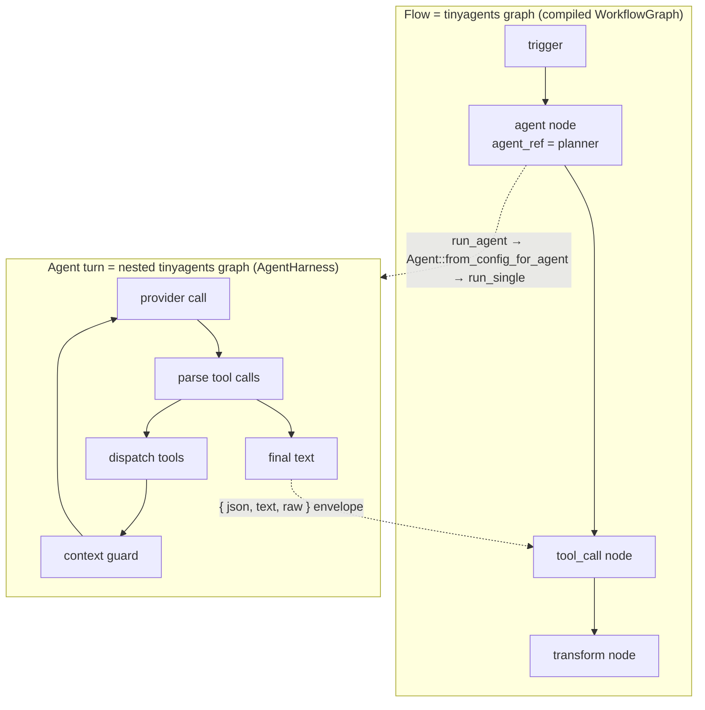
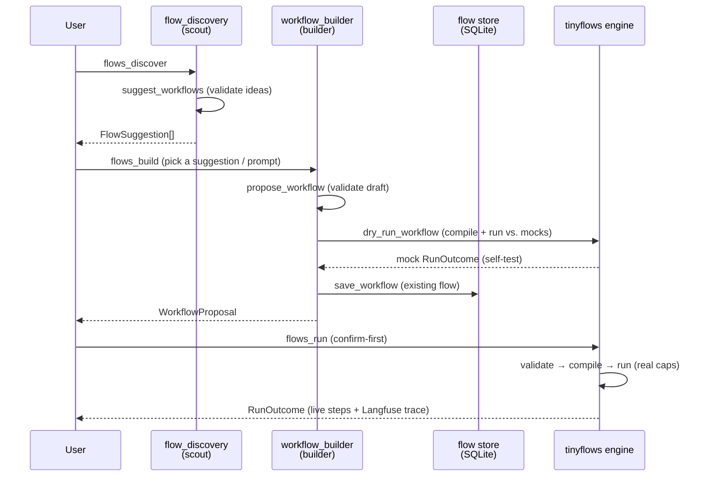

# Flows on TinyAgents

The **flows** domain ([`src/openhuman/flows/`](../../../src/openhuman/flows/)) drives
saved automations - the workflows a user builds in the canvas or the copilot
builds for them. It does **not** contain a workflow engine. Every flow is run by
the vendored, host-agnostic [`tinyflows`](../../../vendor/tinyflows/) crate, which
**lowers each workflow onto the same [`tinyagents`](https://crates.io/crates/tinyagents)
state-graph engine that the [agent harness](agent-harness.md) runs on.** So a
saved flow is a tinyagents graph, and (after harness unification) each of its
`agent` nodes is *itself* a tinyagents graph - a graph within a graph.

This page is the flows counterpart to [Agent Harness](agent-harness.md): where
that page explains how one agent *turn* runs, this one explains how one *flow*
runs, and how the two runtimes compose.

## Two crates, one engine

| Crate | Role | Where |
| --- | --- | --- |
| `tinyflows` | Host-agnostic workflow model + validate + compile + run. Never hard-codes a vendor; every outside-world effect goes through a capability trait. | [`vendor/tinyflows/`](../../../vendor/tinyflows/) |
| `tinyagents` | The published state-graph + agent-loop harness both runtimes lower onto. | crate; OpenHuman seam in [`src/openhuman/tinyagents/`](../../../src/openhuman/tinyagents/) |
| `openhuman::flows` | The host: CRUD/run/resume RPCs, SQLite store, triggers, the builder/scout agents. | [`src/openhuman/flows/`](../../../src/openhuman/flows/) |
| `openhuman::tinyflows` | The **capability seam** - adapters implementing the `tinyflows` traits over real OpenHuman services. | [`src/openhuman/tinyflows/`](../../../src/openhuman/tinyflows/) |

`tinyflows` is published to crates.io and is deliberately persistence-free and
vendor-free (see its [`CLAUDE.md`](../../../vendor/tinyflows/CLAUDE.md)); OpenHuman
is the first downstream host and injects everything real through the seam.

## The run pipeline

A flow is a [`WorkflowGraph`](../../../vendor/tinyflows/src/model/) - a directed
graph of typed [`Node`]s joined by [`Edge`]s, JSON on the wire. Running it is a
fixed four-stage pipeline
([`vendor/tinyflows/src/lib.rs`](../../../vendor/tinyflows/src/lib.rs),
[`compiler.rs`](../../../vendor/tinyflows/src/compiler.rs),
[`engine.rs`](../../../vendor/tinyflows/src/engine.rs)):

```mermaid
flowchart LR
  subgraph host["openhuman::flows (host)"]
    store[(SQLite<br/>flow store)] --> graph[WorkflowGraph<br/>JSON]
  end
  graph --> validate["validate<br/>(structural)"]
  validate --> compile["compiler::compile<br/>(lower onto tinyagents)"]
  compile --> gb["tinyagents<br/>GraphBuilder"]
  gb --> run["engine::run_with_checkpointer<br/>(drive to completion)"]
  run --> outcome["RunOutcome<br/>{ output, pending_approvals, cancelled }"]
  seam["openhuman::tinyflows<br/>capability seam"] -. host-injected .-> run
```

1. **validate** ([`validate.rs`](../../../vendor/tinyflows/src/validate.rs)) -
   structural checks over the raw graph: unique node ids, that every referenced
   node exists, and **exactly one trigger node** (0 → `MissingTrigger`, >1 →
   `MultipleTriggers`). This is the single-trigger invariant the whole model
   rests on (see [Trigger model](#the-trigger-model)).
2. **compile** ([`compiler.rs`](../../../vendor/tinyflows/src/compiler.rs)) - runs
   validation, then lowers the validated graph onto a fresh `tinyagents` state
   graph. **Every tinyflows node becomes a tinyagents graph node**; every
   tinyflows edge becomes a graph edge, with conditional/parallel routing and a
   merge barrier expressed on the tinyagents graph layer. The graph is rebuilt
   per run so compilation stays independent of any host state.
3. **run** ([`engine.rs`](../../../vendor/tinyflows/src/engine.rs)) - the host
   calls `engine::run_with_checkpointer_journaled_observed`
   ([`flows/ops.rs`](../../../src/openhuman/flows/ops.rs), `flows_run`), which
   drives the compiled graph to completion, folding each node's output into the
   run state and pausing at approval gates.
4. **outcome** - a `RunOutcome { output, pending_approvals, cancelled }`; the host
   persists live steps through the `FlowRunObserver` and exports the durable
   graph observations to Langfuse
   ([`tinyflows/langfuse_export.rs`](../../../src/openhuman/tinyflows/langfuse_export.rs)).

Because the engine keys persisted state by a caller-supplied `thread_id`,
durable **HITL resume** is `engine::resume_with_checkpointer` over the same
`tinyagents::graph::SqliteCheckpointer` the agent harness uses - opened once per
host at `<workspace_dir>/flows/checkpoints.db`
([`caps.rs`](../../../src/openhuman/tinyflows/caps.rs), `open_flow_checkpointer`).

## Run state: one JSON map, a merge reducer, and the `{json,text,raw}` envelope

The entire run's working memory is a single `serde_json::Value` laid out as
([`vendor/tinyflows/src/engine.rs`](../../../vendor/tinyflows/src/engine.rs)):

```json
{
  "run":   { "trigger": { /* the trigger payload seeded at start */ } },
  "nodes": {
    "planner": { "items": [ /* … */ ] },
    "drafter": { "items": [ /* … */ ] }
  }
}
```

As the graph executes, a **merge reducer** folds each node's item output into
`nodes.<id>`. Because merging is additive rather than last-writer-wins, a
**fan-in** node can see every predecessor's output at once, and a **fan-out**
(`split_out`) node's parallel branches merge back at the barrier without
clobbering one another - the same reducer pattern the tinyagents graph layer uses
for its own `map_reduce` fan-out (see [Agent Harness](agent-harness.md)).

Every **capability node** (agent / tool_call / http_request / code) emits its
output wrapped in a stable **`{ json, text, raw }` envelope**. Downstream nodes
never see the raw completion shape - they bind against the envelope:

- `=item.json.<field>` - the structured object (when the producer emitted JSON);
- `=item.text` - the prose form;
- `=item.raw` - the untouched producer output.

### The `=`-expression scope

Node config is resolved through jq/jaq `=`-expressions
([`vendor/tinyflows/src/expr.rs`](../../../vendor/tinyflows/src/expr.rs)) against a
per-node **scope** with four bindings:

| Binding | What it holds |
| --- | --- |
| `item` | the first input item's `json` (the direct predecessor's output) |
| `items` | every input item's `json`, in edge order |
| `run` | run metadata and the **trigger payload** (`run.trigger`) |
| `nodes` | **every completed node's output, keyed by id**: `{ "<id>": { "item": …, "items": [ … ] } }` |

So a node three hops downstream can reach back to a specific ancestor by id -
`"=nodes.planner.item.json.plan"` - which is exactly how the demo workflow passes
the planner's structured plan into the drafter's prompt. A `"=item.text"` form is
the short-hand for the immediate predecessor. Missing segments resolve to `null`
rather than erroring, and a malformed jq program yields `null` rather than
panicking - node wiring never crashes the run.

## The capability seam

`tinyflows` touches nothing real on its own. Everything - LLM calls, tools, HTTP,
code, persistence, sub-workflow lookup - is a **capability trait** the host
implements ([`vendor/tinyflows/src/caps/mod.rs`](../../../vendor/tinyflows/src/caps/mod.rs)).
`openhuman::tinyflows::caps` supplies one adapter per trait, assembled into a
`Capabilities` bundle per run by `build_capabilities`
([`caps.rs`](../../../src/openhuman/tinyflows/caps.rs)):

| tinyflows trait | Node(s) it backs | OpenHuman adapter | Wraps |
| --- | --- | --- | --- |
| `LlmProvider` | `agent` (bare), `output_parser` | `OpenHumanLlm` | `inference/provider` (`create_chat_provider`) |
| `AgentRunner` | `agent` (with `agent_ref`) | `OpenHumanAgentRunner` | the agent registry + harness `Agent` |
| `ToolInvoker` | `tool_call` | `OpenHumanTools` | Composio + native `oh:` tools |
| `HttpClient` | `http_request` | `OpenHumanHttp` | `HttpRequestTool` (allowlist + DNS-rebind guard) |
| `CodeRunner` | `code` | `OpenHumanCode` | the sandbox (`execute_in_sandbox`) |
| `StateStore` | resumable/stateful runs | `FlowStateStore` | the `flow_state` KV table |
| `WorkflowResolver` | `sub_workflow` by id | `OpenHumanWorkflowResolver` | the saved-flow store (`load_flow_graph`) |

`AgentRunner` is **optional** in the crate (`Capabilities::agent` is
`Option`): a host without an agent registry leaves it `None` and `agent` nodes
fall back to a bare `LlmProvider` completion. OpenHuman always wires it, so
`agent` nodes get the real agent runtime described next.

## Agent nodes: a graph within the graph

A flow `agent` node names a **registered agent kind** through a trusted
`agent_ref` in its config (researcher, code_executor, a custom specialist, …).
`OpenHumanAgentRunner::run_agent` resolves that ref and routes on what it finds:

- **A harness `AgentDefinition` exists** → build a full harness `Agent`
  (`Agent::from_config_for_agent`) and run the node's request through
  `run_single`. That is the *same* entry the builder/scout and cron/subconscious
  jobs use, and internally it drives `run_turn_via_tinyagents_shared`
  ([`src/openhuman/tinyagents/mod.rs`](../../../src/openhuman/tinyagents/mod.rs)) -
  the tinyagents `AgentHarness` tool-call loop. The definition's ToolScope,
  `sandbox_mode`, and `max_iterations` govern the inner turn.
- **Only a custom `AgentRegistryEntry` exists** (no full definition) → the
  persona-shaping fallback: the entry's `system_prompt` (and model, when the node
  didn't pin one) is prepended and the request runs through
  `OpenHumanLlm::complete` - a single completion, no private tool loop. This
  keeps custom registry agents working without a regression.

The consequence is the nesting the plan set out to achieve: **the flow is a
tinyagents graph whose `agent` nodes each run a nested tinyagents graph (one
agent turn).**



Either path returns a JSON value; the `agent` node folds it into the
`{ json, text, raw }` envelope (with an `output_parser` sub-port applying the
node's declared schema), so a downstream node's binding is identical whether the
node ran a full agent turn or a bare completion.

`agent_ref` is resolved **from trusted node config only, never from model
output**, so a prompt-injected upstream completion cannot pick an arbitrary agent
kind. The **builder's dry-run** exercises this path too:
`dry_run_workflow` compiles a draft and runs it against `tinyflows`' *mock*
capabilities wired with a `MockAgentRunner`
([`vendor/tinyflows/src/caps/mock.rs`](../../../vendor/tinyflows/src/caps/mock.rs)),
so a draft whose `agent` nodes carry an `agent_ref` is self-tested end-to-end
before it is ever saved.

## The security model: two gates

A flow run is guarded on **two independent layers**, an outer one owned by the
flows runtime and an inner one owned by the agent harness.

**Outer gate - the flow's origin + autonomy tier.** `flows_run`/`flows_resume`
scope a `TrustedAutomation { source: Workflow { require_approval } }` origin
around the whole engine future
([`flows/ops.rs`](../../../src/openhuman/flows/ops.rs), via
`with_origin`). Before an *acting* node dispatches, the seam consults the user's
`[autonomy]` tier through `SecurityPolicy::gate_decision` for that node's
`CommandClass` (`http_request` → Network, `code` → Write, native `oh:` tools →
their classified class) in `enforce_node_tier_gate`
([`caps.rs`](../../../src/openhuman/tinyflows/caps.rs)):

- a `readonly` run **`Block`s** at the network/code boundary and never dispatches;
- a `supervised` run's `Prompt` decision is escalated by `gate_call_for_tier`
  into a **forced `ApprovalGate` round-trip** - even when the flow's own
  `require_approval` is `false`, so the tier's "ask me" can't be silently
  defeated by a saved flow's default trust;
- a `full` run passes through.

Composio `tool_call` nodes get an extra deny-by-default **curation gate**
(`is_curated_flow_tool`): a slug is allowed only if it resolves to a known,
curated, in-scope, connected toolkit action - stricter than the general agent
tool-call path, because a flow's slug is a free-form string the author typed
rather than one the backend returned from live discovery.

**Inner gate - the agent definition's ToolScope + sandbox.** When an `agent`
node runs a full harness `Agent`, that turn runs under the *same* `Workflow`
origin (the engine future is already inside `with_origin`), so the autonomy tier
and approval gate apply to the inner turn automatically - **no new origin
wrapper**. On top of that, the agent definition's own `ToolScope`,
`sandbox_mode`, and iteration cap bound what the turn can do, exactly as they do
for a chat sub-agent. So an `agent` node is gated twice: the flow's outer
autonomy/origin gate and the agent's inner tool/sandbox gate.

`agent_ref` being trusted-config-only is the third leg: untrusted trigger or
upstream data can influence *arguments* (bounded by the curation + scope +
approval checks) but never *which agent kind or tool identity* runs.

## The trigger model

`tinyflows` enforces **exactly one trigger node per graph** at validate time
([`validate.rs`](../../../vendor/tinyflows/src/validate.rs)). A workflow therefore
has a single entry point, and the trigger's payload is what seeds `run.trigger`
in the run state.

That is a *model-level* constraint, not a product limitation. **Multi-trigger is
a host-side concern today**, handled by the flows domain rather than the engine.
`FlowTriggerSubscriber` ([`flows/bus.rs`](../../../src/openhuman/flows/bus.rs)) is
the trigger → run bridge: it subscribes to the normalized domain events a saved
flow's single trigger node can bind to and calls `flows::ops::flows_run` for each
match:

- **`DomainEvent::FlowScheduleTick`** - a `flow`-type cron job fired; the one
  named flow is loaded, re-checked for a still-live `schedule` trigger, and
  dispatched with an empty trigger payload.
- **`DomainEvent::ComposioTriggerReceived`** - every enabled flow with an
  `app_event` trigger bound to that `toolkit`/`trigger_slug` is dispatched with
  the event payload seeded into `run.trigger`.

Dispatch is deduped per `flow_id` (a trigger burst can't spawn overlapping runs
for the same flow), while the interactive `flows_run` RPC is deliberately *not*
deduped - a user asking to run a flow again is always honored.

So "run this flow on a schedule **and** when a Gmail message arrives" is
expressed as two host subscriptions fanning into the same one-trigger graph.
**Model-level multiple triggers on one graph are future work**, tracked as such;
nothing in the seam or the store depends on it today.

## Builder, scout, and executor: one harness

The three agents that touch flows all run on the shared agent harness -
`Agent::from_config_for_agent` → `run_single` under a scoped origin - the same
pattern the flow's own `agent` nodes use:

| Agent | Registry id | Entry point | Tool belt |
| --- | --- | --- | --- |
| **Builder** (copilot) | `workflow_builder` | `flows_build` ([`ops.rs`](../../../src/openhuman/flows/ops.rs)) | `propose_workflow` / `revise_workflow` (validate-only), `dry_run_workflow` (compile + run vs. mocks), `save_workflow`, `run_workflow`, catalog/connection reads ([`builder_tools.rs`](../../../src/openhuman/flows/builder_tools.rs)) |
| **Scout** (discovery) | `flow_discovery` | `flows_discover` ([`ops.rs`](../../../src/openhuman/flows/ops.rs)) | `suggest_workflows` ([`discovery_tools.rs`](../../../src/openhuman/flows/discovery_tools.rs)) |
| **Executor** | *(n/a - the engine)* | `flows_run` / `flows_resume` | the capability seam above |

Both agents live under
[`src/openhuman/flows/agents/`](../../../src/openhuman/flows/agents/) as
first-class registry agents (`agent.toml` + `prompt.md`), on the reasoning tier
with narrow, safety-reviewed tool belts. The builder is tool-assisted
end-to-end: it *proposes* graphs (validate-only), *dry-runs* them against mock
capabilities as a self-test loop, and only then *saves* and confirm-first
*test-runs* a real flow. The full discover → build → save → run lifecycle:



## Where to look in the code

| Path | What lives there |
| --- | --- |
| [`vendor/tinyflows/src/`](../../../vendor/tinyflows/src/) | The engine: `model/`, `validate.rs`, `compiler.rs`, `engine.rs`, `expr.rs`, `caps/`, `nodes/`. |
| [`vendor/tinyflows/src/caps/mod.rs`](../../../vendor/tinyflows/src/caps/mod.rs) | The seven capability traits + `Capabilities` bundle. |
| [`src/openhuman/tinyflows/caps.rs`](../../../src/openhuman/tinyflows/caps.rs) | The host adapters, `build_capabilities`, `open_flow_checkpointer`, the two-layer gate helpers. |
| [`src/openhuman/flows/ops.rs`](../../../src/openhuman/flows/ops.rs) | `flows_run` / `flows_resume` / `flows_build` / `flows_discover` and CRUD. |
| [`src/openhuman/flows/bus.rs`](../../../src/openhuman/flows/bus.rs) | `FlowTriggerSubscriber` - the host-side multi-trigger bridge. |
| [`src/openhuman/flows/builder_tools.rs`](../../../src/openhuman/flows/builder_tools.rs) | The builder's `propose` / `revise` / `dry_run` / `save` / `run` tools. |
| [`src/openhuman/flows/agents/`](../../../src/openhuman/flows/agents/) | `workflow_builder` + `flow_discovery` agent definitions. |
| [`src/openhuman/tinyflows/langfuse_export.rs`](../../../src/openhuman/tinyflows/langfuse_export.rs) | Post-run export of the durable graph observations. |

## See also

- [Agent Harness](agent-harness.md) - the tinyagents turn every `agent` node (and
  the builder/scout) runs on.
- [Security (`src/openhuman/security/`)](security.md) - the `SecurityPolicy` /
  autonomy tier the outer node gate consults.
- [Architecture overview](README.md) - where flows sit in the bigger picture.
